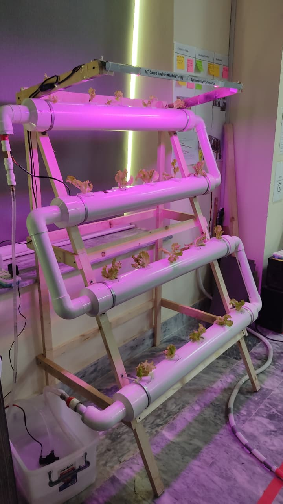
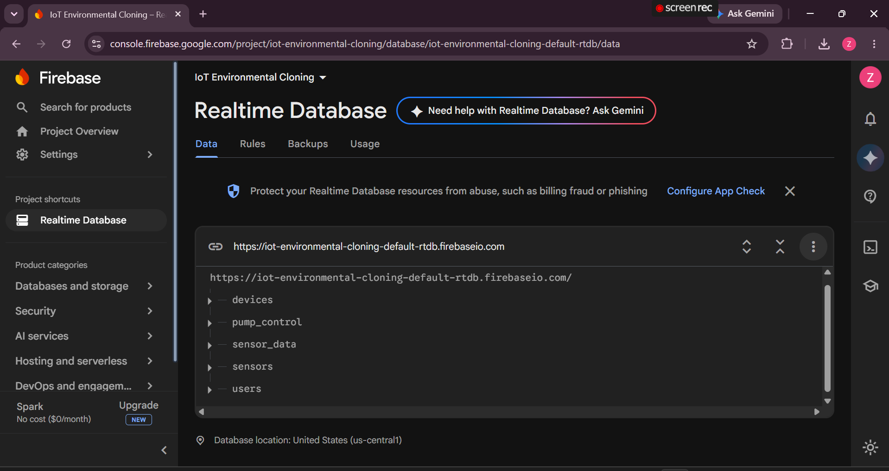
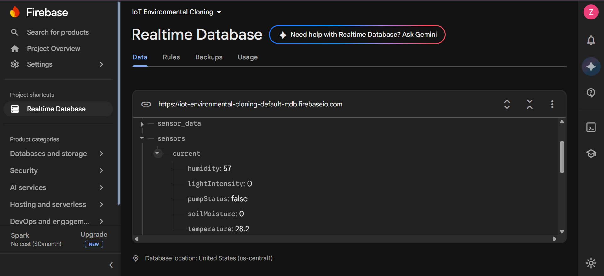

# IoT-Based Environmental Cloning System Using Hydroponics

An IoT-enabled controlled-environment cultivation system developed collaboratively during an internship at the **Sino-Pak Center for Artificial Intelligence (SPCAI), PAF-IAST**.

The project extended concepts initially explored by our team in an undergraduate smart-irrigation prototype toward a larger hydroponic cultivation environment incorporating environmental monitoring, cloud-based data management, automated control, water recirculation, and resource-cycle management.

---

## Project Overview

The project explores the use of IoT and cloud technologies for monitoring and managing a controlled hydroponic cultivation environment.

Environmental parameters are collected from the physical system and synchronized with **Firebase Realtime Database**, enabling centralized storage and real-time access to sensor and system-control information.

The physical setup incorporates multi-level hydroponic cultivation, artificial grow lighting, circulating water, environmental sensing, and automated control components.

<p align="center">
  
</p>

---

## Project Evolution

This work represents a further development of concepts initially explored by our team through our Final Year Project:

**IoT-Based Smart Irrigation System for Non-Seasonal Plants**

The earlier project served as a prototype for:

- IoT-based environmental monitoring
- Cloud connectivity using Firebase
- Sensor-data management
- Remote monitoring and control
- Automated irrigation

During the subsequent SPCAI internship, the same team continued the work and extended these concepts toward a larger **environmental-cloning and hydroponic cultivation system** under the supervision of our project supervisor.

The extension provided an opportunity to apply and further develop the software, cloud, monitoring, and control concepts established during the prototype stage within a broader controlled-environment cultivation setup.

---

## System Concept

The system follows a connected environmental-monitoring architecture:

```text
Environmental Sensors
        │
        ▼
  ESP32 IoT Nodes
        │
        ▼
Environmental Data
        │
        ▼
Firebase Realtime Database
        │
        ├──────────────► Monitoring / Data Access
        │
        ▼
 System Control Data
        │
        ▼
 Pumps / Environmental System
        │
        ▼
 Hydroponic Cultivation
```

This architecture enables environmental information generated by the physical system to be stored and managed through a cloud-based backend.

---

## Cloud Database Integration

**Firebase Realtime Database** was used as the cloud data layer for storing and synchronizing environmental measurements and system information.

The database supported IoT-generated environmental data and system-control information, allowing the software components of the project to access and manage data through a centralized cloud backend.

### Firebase Realtime Database

The Firebase Realtime Database provided the cloud-based backend for organizing and managing data generated by the environmental monitoring system.

<p align="center">
  
</p>

### Environmental Sensor Data

Sensor measurements collected from the environmental monitoring system were stored in the database, including parameters such as temperature, humidity, light intensity, air quality, and soil moisture.

<p align="center">
  
</p>
## Resource & Life-Cycle Management

In addition to hydroponic cultivation, the experimental setup incorporated a small fish-based biological component as part of its exploration of **waste management and continuous resource cycling**.

The concept explored how biological waste and circulating water could contribute to a more continuously managed cultivation environment.

This component complemented the project's broader objective of exploring an interconnected system involving:

**plants → water circulation → biological resources → environmental monitoring → system management**

---

## My Contribution

This was a **collaborative team project**. My work during the SPCAI internship was primarily focused on the **software and cloud-data components** of the extended system.

My contributions included:

- Software development and system integration
- Firebase Realtime Database integration
- Cloud-based environmental-data management
- Structuring and managing sensor and system information within the database
- Integration of IoT-generated data with the cloud backend
- Supporting the extension of the original smart-irrigation prototype into the hydroponic environmental-cloning system

The physical system, hardware integration, experimentation, and overall project development were collaborative efforts undertaken by the project team under supervision.

---

## Technologies & Components

| Category | Technologies / Components |
|---|---|
| Cloud Backend | Firebase Realtime Database |
| IoT | ESP32-based connected devices |
| Environmental Monitoring | Temperature, humidity, light, air quality and related sensing |
| Control | Pump/control states |
| Cultivation | Multi-level hydroponic setup |
| Environment | Artificial grow lighting |
| Resource Management | Water circulation and biological waste/resource-cycle concept |

---

## System Demonstration

A demonstration of the physical environmental-cloning/hydroponics setup is included in this repository.

### [View System Demonstration](media/system-demo.mp4)

The demonstration provides visual evidence of the extended physical cultivation system developed collaboratively during the project.

---

## Repository Structure

```text
IoT-Based-Environmental-Cloning-System-Using-Hydroponics/
│
├── database/
│   ├── environmental-sensor-data.png
│   └── firebase-realtime-db.png
│
├── media/
│   ├── hydroponics-system.jpg
│   └── system-demo.mp4
│
└── README.md
```

---

## Internship Context

**Organization:** Sino-Pak Center for Artificial Intelligence (SPCAI), PAF-IAST  
**Project:** IoT-Based Environmental Cloning System Using Hydroponics  
**Role:** Software Development & Cloud Database Intern  
**Internship Period:** May 18, 2026 – August 11, 2026

This repository is intended as a **project and research-experience showcase** documenting my involvement and selected contributions to the collaborative project. It does not contain the complete implementation or internal project resources.

---

## Project Team

The project was developed collaboratively by the same team that worked on the original smart-irrigation prototype.

### Team Members

- **Zawish Noor**
- **Aleesha Khan**
- **Shujahat Alam**

### Supervisor

**Mr. Muhammad Adil Khan**

---

## Related Work

This project builds upon concepts initially developed through our Final Year Project:

**IoT-Based Smart Irrigation System for Non-Seasonal Plants**

The earlier project focused on developing a prototype for IoT-based environmental monitoring, cloud connectivity, mobile monitoring, and automated irrigation. The subsequent SPCAI work extended these concepts into a broader controlled hydroponic cultivation environment.

---

## Repository Maintainer

**Zawish Noor**  
BS Computer Science  
PAF-IAST, Pakistan

This repository documents my involvement and contributions to the collaborative project for academic and research-portfolio purposes.

**Research Interests:** Environmental computing, remote sensing, cloud-based environmental data systems, and data-driven approaches for water and environmental applications.
